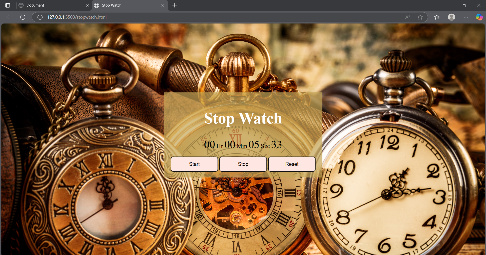

# 🕒 Stopwatch Web App

A sleek and functional stopwatch built using **HTML**, **CSS**, and **JavaScript**. This simple yet effective tool features three core controls—**Start**, **Stop**, and **Reset**—allowing users to track time with precision. Whether for productivity, workouts, or coding sprints, this stopwatch is quick to use and easy to love.

## 🔧 Features

- **Start**: Begins the timer from zero or continues after pause  
- **Stop**: Halts the timer without resetting  
- **Reset**: Clears the current time and starts fresh  
- **Smooth UI**: Responsive layout with a visually appealing background for an engaging experience  
- **Lightweight**: Pure vanilla JavaScript without any frameworks  

## 🎨 Design Highlights

- Beautiful animated or gradient background enhances the aesthetic  
- Minimalist layout for clarity and ease of interaction  
- Custom styles crafted with CSS for buttons and time display  

## 🚀 Getting Started

1. Clone the repository:
   ```bash
   git clone https://github.com/your-username/stopwatch-app.git


